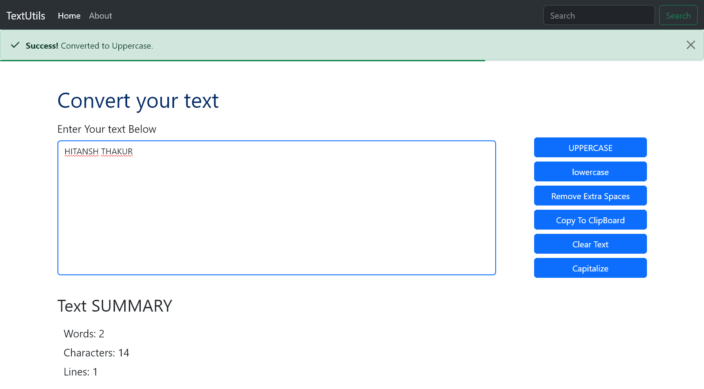

# Text Utils App

Text Utils App is a simple web application built using React and Bootstrap that provides various text utilities to users. The app allows users to perform different operations on text such as converting text case, removing extra spaces, counting characters, and more.

## Features

- Convert text to uppercase or lowercase
- Remove extra spaces from text
- Count number of words and characters in text
- Copy text to clipboard
- Preview changes in real-time

## Installation and Setup

To run the application, you need to have Node.js and npm installed on your machine. Then, follow these steps:

1. Clone the repository or download the zip file
2. Open the terminal and navigate to the project directory
3. Install the dependencies using `npm install`
4. Start the development server using `npm start`

The application should now be running on [http://localhost:3000](http://localhost:3000).

> **_NOTE :_** This assumes that you have already set up your development environment for React. If you haven't, please refer to the official React documentation for instructions on how to do so.

## Usage

Once the application is running, users can simply input their text in the text area provided and choose the desired operation from the options provided. The app will perform the selected operation in real-time and show the results on the screen. Users can then copy the modified text to the clipboard using the "Copy" button provided.

## Technologies Used

- React: JavaScript library for building user interfaces
- Bootstrap: CSS framework for building responsive web applications

## Contributing

Contributions are welcome and encouraged. To contribute, please follow these steps:

1. Fork the repository
2. Create a new branch for your changes
3. Make your changes and commit them
4. Push your changes to your fork
5. Create a pull request to merge your changes into the main branch

Please ensure that your code follows the existing style and conventions, and that all tests pass before submitting your pull request.

<!-- include an image of the website -->
## Screenshots
> Working image of the website

---
## Footer
### Author

>[**Hitansh Thakur**](github.com/hitansh-thakur)

>Date: 16-05-2023